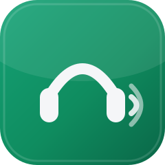

<div align="center">



# Clear English Speaking

### 给所有人用的英语精听技能 · 把 BBC 6 Minute English 变成双击就能打开的练习页

🗣️ 英语精听&nbsp;&nbsp;·&nbsp;&nbsp;🎙️ 影子跟读&nbsp;&nbsp;·&nbsp;&nbsp;🤖 Agent 技能&nbsp;&nbsp;·&nbsp;&nbsp;💻 本地工具&nbsp;&nbsp;·&nbsp;&nbsp;🆓 免费使用

[](https://github.com/Adam-zhaoding/clear-english-speaking/actions/workflows/verify.yml)
[](LICENSE)
[](https://github.com/Adam-zhaoding/clear-english-speaking/stargazers)
[](https://github.com/Adam-zhaoding/clear-english-speaking/commits/main)

[](scripts/make_lesson.py)
[](#)
[](#)
[](SKILL.md)

</div>

---

> 先把耳朵叫醒，再谈开口。

## 一句话介绍

把 BBC 6 Minute English 的一期节目，变成你电脑上一个**双击就能打开**的英语练习页：
整集精听（变速、快进快退）+ 3–5 句影子跟读（单句循环、隐藏字幕、看翻译、录音回听）。

不需要 API Key，不需要装 Node，不需要开终端敲一堆命令。
你只要会复制粘贴一段话给 WorkBuddy、Codex、Claude Code 等 Agent，对新手极其友好。

---

## 🎯 这能帮你解决什么

| 你的需求 | 这个技能给你什么 |
|---|---|
| 🤖 不会写代码、不想装环境 | 发一句话给 WorkBuddy（或其他有文件权限的 Agent），它自己装技能、自己排错、自己备课，你全程不用开终端 |
| 📻 想要地道、专业的听力素材 | 每一句英文逐字来自 **BBC 官方 Transcript PDF**，本地 Whisper 只用来对时间戳，绝不会把转写错的句子当成原文 |
| 🎯 想练指定内容/方向 | 默认自动挑一期你还没练过的最新节目；也可以用 `--url` 精确指定某一期 BBC 6 Minute English |
| 💰 不想付费、不想要 API Key | 全流程免费，不依赖任何付费 API；本地语音模型只需下载一次 |
| 💻 在意隐私、不想联网上传 | 语音对齐、录音回听全部在本地电脑完成，BBC 音频和你的录音都不会上传、不会被局域网内其他人访问 |
| 🔁 想每天自动练一期新内容 | 配合 WorkBuddy 的定时任务，每天自动挑没练过的新一期、自动备课、自动把结果推给你 |
| 🎧 只想磨耳朵，不想被逐句打断 | 整集音频支持变速、快进快退随便听；只挑 3–5 句重点做影子跟读，其余时间正常听整集 |

---

## 🚀 最快的用法：把下面这段话发给 WorkBuddy

> 帮我装一个英语学习技能，然后给我备今天的课。
>
> 1. 把 `https://github.com/Adam-zhaoding/clear-english-speaking` 装到我电脑上，
>    位置你自己定一个固定的地方，以后每次都用同一个位置，不要重复下载。
>    记住这个位置，以后我说「备今天的英语课」你直接用它，不用我再给地址。
> 2. 打开里面的 `SKILL.md`，完全按它写的流程做到底。
> 3. 缺什么依赖你自己装，装完继续，不用回来问我。
> 4. 课程存到哪、工作目录放哪，都按 `SKILL.md` 的默认规则来，不要问我要路径。
> 5. 中间不要停下来等我确认。只有真的需要我在屏幕上点一下（比如授权文件夹），
>    才停下来，并且明确告诉我点哪个按钮。
> 6. 全部做完，把本地预览地址和 HTML 完整路径都发我，附一句这期讲什么、你挑了哪几句、
>    每句的中文意思和难在哪。
>
> 我完全不写代码，看不懂报错。任何失败都用大白话告诉我卡在哪、我要不要管。
> 装的时候要下载一个语音模型，会慢几分钟，这是正常的，别中断；装完之后每节课就快了。

WorkBuddy 会自己完成：装技能 → 挑一期没备过的 → 下载官方音频和 Transcript → 本地转写对齐 →
挑句子写翻译 → 生成练习页 → 起本地预览服务。**装好之后，一节课大约 1 分钟**，
其中 40 秒是本地语音对齐在跑。

**第一次**要装依赖并下载 145MB 的语音模型，会多花几分钟。这笔时间只付一次，
而且是在装的时候付掉（`make_lesson.py doctor`），不会混进你第一节课的等待里。

课程默认存到你的**「文档 / ClearEnglish」**文件夹，你不用指定路径。
做完你会拿到一个像 `260813_who-does-the-housework.html` 的文件，双击打开就能练；
在 WorkBuddy 里则用它给你的 `http://127.0.0.1:8931/...` 地址打开。

---

## 🔁 想让它每天自动备课

用 WorkBuddy 自己的定时任务功能，建一个每天触发的任务，内容写这段：

> 用 clear-english-speaking 技能备一节新的 BBC 6 Minute English。
>
> 技能和课程目录都用上次已经建好的那一个，不要另建、不要换位置。
>
> 先跑 `prepare`，它会自己挑一期我还没练过的：
> - 输出里出现 `NOTHING_NEW`，说明列表上的期次全练完了，回我一句就结束，
>   不要重复备课，不要硬凑一节。
> - 正常拿到一期，就按 `SKILL.md` 走完整流程做出来。
>
> 现在没人在旁边，全程别提问、别等确认，一个人走完。
>
> 做完推给我：这期讲什么、音频多长；挑的 3-5 句（英文原句 + 中文翻译 + 难在哪）；
> 本地预览地址和 HTML 完整路径。
>
> 失败了也要推给我，说清楚卡在哪一步、我需不需要做什么。不要自己反复重试。

不用填任何路径。课程固定落在「文档 / ClearEnglish」，技能靠这个固定目录记住
哪些期次已经备过——所以别手工挪走生成的 HTML，挪走就等于失忆，会把同一期再备一遍。

BBC 每周更新一期，你却是每天练。所以技能不只盯最新一期：它从新往旧翻列表页，
挑第一期你还没练过的。这个比对在下载音频之前完成，不会白下 7MB。

---

## 🖥️ 在 WorkBuddy 里打开

WorkBuddy 的内置浏览器打不开 `file://`，所以技能每次备完课都会起一个本地静态服务：

```bash
python scripts/make_lesson.py serve
```

它**只监听 `127.0.0.1:8931`**，同一个局域网里的别人访问不到——课件里内嵌着 BBC 音频，
那是你的个人副本，不该出这台电脑。跑起来之后用
`http://127.0.0.1:8931/<期次>_<标题>.html` 打开，播放、跟读、录音全都正常。

在 WorkBuddy 之外，双击 HTML 一样能练，不需要这个服务。

---

## 🎙️ 关于录音

页面里有「录音 → 回听」，可以把自己的跟读和原句对照。**双击打开就能用**，
不需要起本地服务，不需要开终端。

第一次点「录音」时，浏览器会问一次麦克风权限，**允许一次就够了**：
这次授权对整个页面所有句子有效，后面每一句都不会再打断你。

（Chrome 和 Edge 把双击打开的本地文件视为安全上下文，麦克风是通的。
这一点在 `probe/` 的探针里实测验证过，三个环境的结果都可以自己复现。）

---

## 📁 目录里都有什么

| 文件 | 作用 |
|---|---|
| `SKILL.md` | WorkBuddy 读的说明书。它按这个流程干活 |
| `scripts/make_lesson.py` | 备课流水线：`doctor` 装后自检 / `prepare` 取材对齐 / `build` 渲染 / `serve` 本地预览 |
| `scripts/selftest.py` | 离线自检，改完代码跑一次 |
| `assets/player-template.html` | 练习页模板 |
| `assets/icon.svg` | 仓库图标，README 顶部用 |

## ⌨️ 手动跑（给愿意开终端的人）

```bash
python -m pip install requests beautifulsoup4 pypdf faster-whisper

cd scripts
python make_lesson.py doctor          # 装完跑一次：查依赖、预下语音模型
python make_lesson.py prepare --workspace lesson-work
# 这一步之后，让 AI 读 lesson-work/draft-request.json，
# 挑 3-5 句写成 lesson-work/draft.json（格式见 SKILL.md）
python make_lesson.py build --workspace lesson-work
python make_lesson.py serve           # 需要在 WorkBuddy 里打开时
```

`prepare` 把词级时间戳写进 `lesson-work/<期次>.alignment.json`，`build` 直接读它，
所以 build 只要零点几秒。别删这个文件、别换 workspace，否则 Whisper 会白跑第二遍。

课程默认落在「文档 / ClearEnglish」，`prepare` 也会拿它做重复检查。
想换地方就给 `build --output <目录>`，但记得 `prepare --courses` 要指向同一个，
否则去重会失效。

想指定某一期，给 prepare 加 `--url <BBC 期次页地址>`。
对齐不够准，把 `--model base.en` 换成 `--model small.en` 重跑。

---

## 📄 版权

- 只使用 BBC Learning English 的官方页面、官方音频、官方 Transcript PDF。
- 不绕过地区限制、访问控制或版权标识。
- 生成的 HTML 里内嵌了 BBC 音频，**这是你的个人本地副本**：不要上传、不要提交到仓库、不要分享。
- 这个仓库本身不包含任何 BBC 素材。
