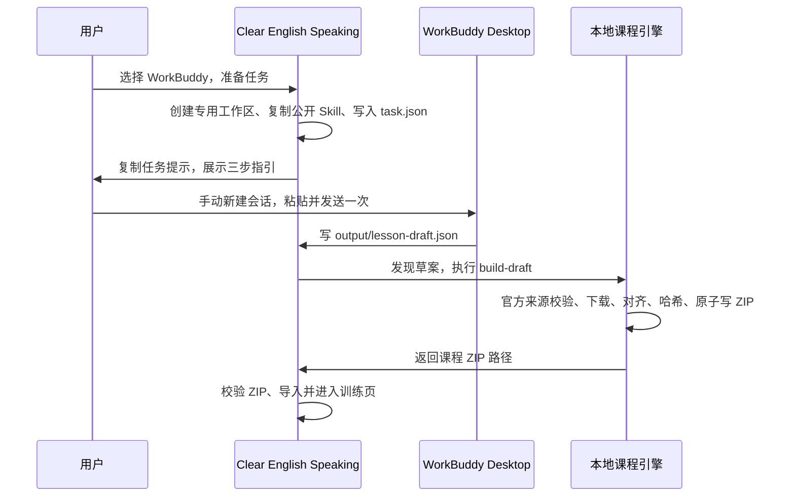
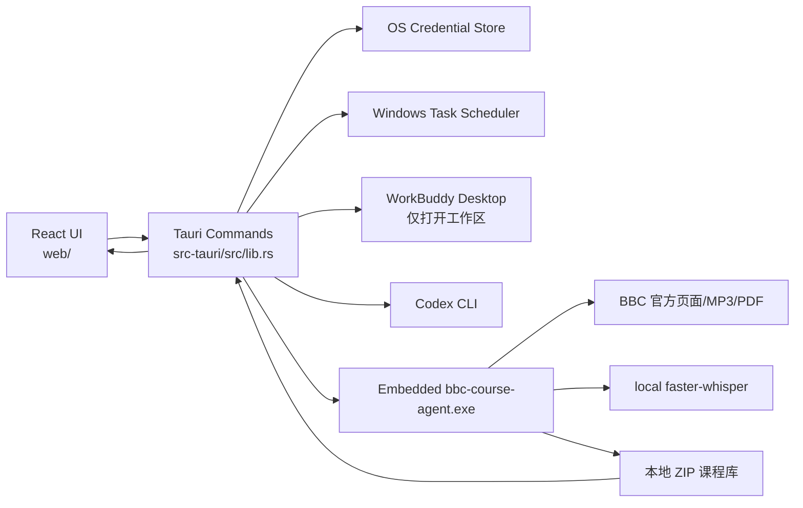
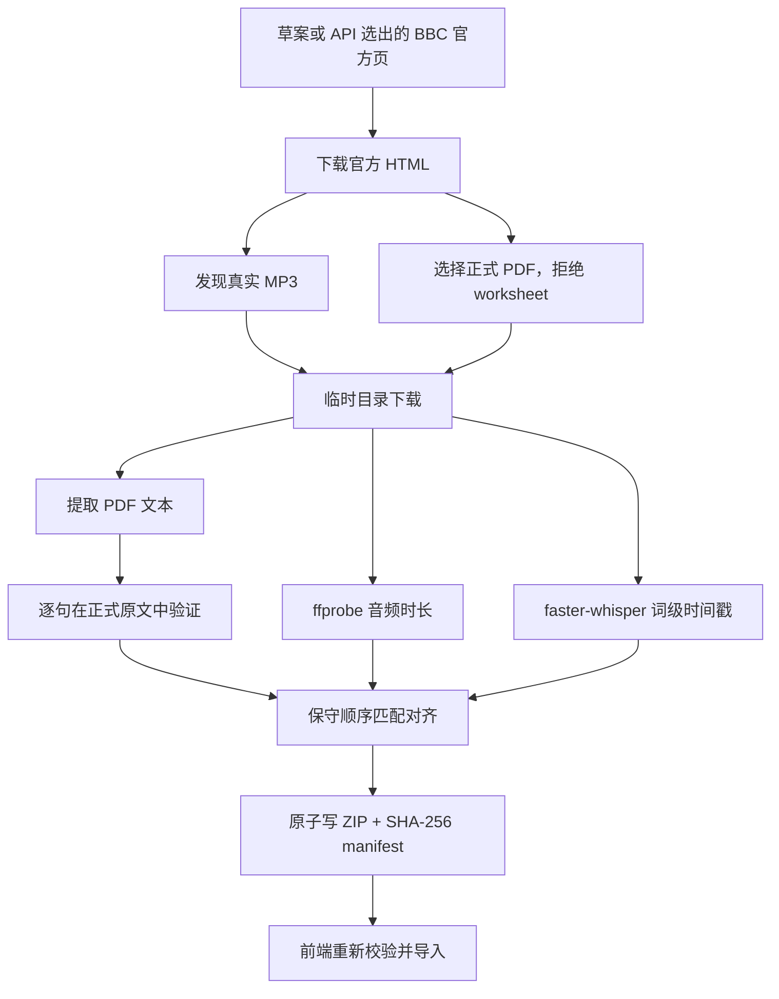

# Clear English Speaking 产品需求文档（PRD + 技术交接）

> 版本：0.3（小白可用性修复版）  
> 更新日期：2026-08-15  
> 面向读者：产品负责人、前端/桌面端/AI 工程师、测试人员，以及接手本仓库的编码 Agent。  
> 文档原则：本文将 **“已实现并验证”**、**“代码已有但未完成端到端验收”**、**“后续规划”** 分开描述。不要把规划当成现有功能。

---

## 1. 一页结论

Clear English Speaking 是一款 Windows 优先、PC 优先、完全本地优先的英语听力与口语练习播放器。它把 BBC Learning English 的 6 Minute English 单期素材，在用户电脑上转为可离线使用的课程包，再提供“盲听 → A/B/C 卡点 → 针对训练 → 原速回测”的训练闭环。

首要目标不是做一个泛化的英语聊天机器人，也不是替用户给口音打分，而是让用户清楚知道：**哪一句没听出来、为什么没听出来、重新听后是否真正过关。**

当前已达到的核心能力：

1. Windows Tauri 桌面播放器可启动，课程可自动或手动导入；离线播放代码路径已具备，但尚未完成断网端到端验收。
2. WorkBuddy、Codex CLI、用户自有 OpenAI-compatible API 三种备课入口代码已实现；目前只有 WorkBuddy 已完成真实端到端构建验收。
3. WorkBuddy 不需要 API Key；其边界是用户必须在 WorkBuddy 手动新建会话并发送一次任务。
4. BBC 官方页面、音频、正式 PDF、教学句、时间轴和 ZIP 哈希均有本地校验链。
5. 已使用 WorkBuddy 真实草案成功生成 `240912.zip`，其中包含 6 个训练句、音频、PDF、`lesson.json` 与 `manifest.json`。
6. 播放器启动时会扫描本地课程目录并导入完成的课程，不需要用户再找文件或重复点“备课中心”。
7. **音频时长在引擎内解析，不再依赖用户电脑上的 `ffprobe`**；对真实 BBC MP3 与 `ffprobe` 的差异为 26 毫秒。
8. **首次运行自带可发声的合成演示课**，小白装好即可验证播放链路，无需先完成一次备课。
9. **逐句训练失败不再让整集报废**：句子层失败时产出 `mode: "listen_only"` 课程，整集音频仍可完整播放、暂停、快进快退。
10. **备课任务有持久化状态机**（`awaiting_agent → draft_ready → building → imported/failed`）与实时阶段进度、失败原因、重试与删除。

当前不应对外承诺：macOS 正式版、安装包/代码签名/自动更新、WorkBuddy 静默后台会话创建、自动发音评分、跨设备同步、云端账号、所有 BBC 页面的无人工审核成功率。

---

## 2. 背景、问题与产品决策

### 2.1 用户问题

传统的“音频 + Transcript PDF”能让用户反复播放，但很难留下以下可行动信息：

- 是不认识词（词汇问题），还是认识却没从语流中听出来（语音识别问题），还是听到却没理解（语义/结构问题）。
- 对某一句反复练过之后，原速、无字幕时是否真正通过。
- 学习数据、录音和 BBC 材料能否完全留在用户自己的电脑上。
- 没有 API Key、只安装 WorkBuddy 的普通用户能否完成一节课的备课。

### 2.2 核心产品决策

| 决策 | 选择 | 原因 |
|---|---|---|
| 产品形态 | React PWA + Tauri 桌面壳 | 播放、离线数据和跨平台 UI 复用；桌面壳提供本地文件、系统凭据库和计划任务能力。 |
| 首发平台 | Windows | 当前已验证 Windows GNU Release；macOS 后续跟进。 |
| 课程交付物 | 标准 ZIP 课程包 | 播放器与课程生成解耦；用户可备份、导入、迁移。 |
| BBC 内容来源 | BBC Learning English 官方页 + 官方音频 + 官方 PDF | 不用搜索摘要、第三方转录或 ASR 文本作为原文权威。 |
| AI 的责任 | 只生成教学草案 | AI 不能决定原文真伪、音频 URL、文件哈希或最终入库。 |
| 隐私 | 本机存储，无账号、无云同步 | API Key 仅存 OS 凭据库；课程、录音和学习记录不上传。 |
| 发音反馈 | 不自动评分 | 单次 ASR 误识别不足以证明用户发音错误；只保留可选录音与回听。 |

### 2.3 非目标

- 不绕过 BBC 的地区限制、访问控制或版权标识。
- 不在 GitHub、Release、Pages 中分发 BBC MP3、正式 PDF 或完成的 BBC ZIP。
- 不把 WorkBuddy Desktop 假装成可被外部程序静默控制的 CLI。
- 不提供“虚构总分”“AI 成长曲线”等没有真实学习数据支撑的 UI。
- 不接入 Hermes/飞书既有推送链路，也不修改其任务。

---

## 3. 目标用户与用户旅程

### 3.1 用户画像

**主要用户：安装了 WorkBuddy、但不会使用命令行的英语学习者。**

- 希望直接双击桌面软件。
- 不想安装 Node、Python、ffmpeg，不愿维护终端窗口。
- 可能没有 API Key，但已在 WorkBuddy 登录。
- 关注 BBC 6 Minute English 的真实材料、离线学习和个人隐私。

**次要用户：已登录 Codex CLI 的开发者/高级用户。**

- 希望使用已有 Codex 账号配额生成教学草案。
- 接受首次授权确认，但不希望手动填写 Key。

**第三类用户：自带模型服务的用户。**

- 在桌面 UI 填写 HTTPS Base URL、模型名与 API Key。
- Key 必须不进入浏览器 LocalStorage、日志或 ZIP。

### 3.2 WorkBuddy 小白路径（当前产品路径）



**必须如实表达的产品边界：**WorkBuddy Desktop 当前没有已验证的公开 API/CLI，可供播放器自动新建聊天或点击发送。因此“新建会话 + 粘贴 + 发送一次”是已验证的人机交接边界，不得描述为静默全自动备课。

### 3.3 单节训练路径

1. 首页显示真实学习状态、最近课程和备课入口；没有练习记录时显示引导而非分数。
2. **训练页默认进入「整集播放」**：进度条可拖到任意位置，±10 秒快进快退，暂停/继续，变速与整集循环都不受句子边界约束。这是唯一在任何课程上都可用的模式。
3. 点击「影子跟读（N 句）」切换到逐句训练；可随时点「回到整集播放」切回。
4. 选择 5–6 个重点句，用户可循环、变速、查看译文和词义。
4. 对每句标记一种卡点：
   - **A：词不认识**：词汇或词块不足。
   - **B：认识但没听出来**：连读、弱读、重音、边界等语流识别问题。
   - **C：听出来但没懂**：句法、指代、逻辑或信息结构问题。
5. 根据卡点显示解释，随后隐藏文本、原速回测，并记录真实状态。
6. 用户可选录音回听；不做自动口音分数。

---

## 4. 体验与视觉设计

### 4.1 设计语言

- 桌面布局：左侧窄导航 + 居中内容区；不复制手机刘海、底部导航或参考图中的虚构指标。
- 风格：暖象牙白背景、鼠尾草绿/森林绿主色、浅薄荷辅助色、深灰褐正文。
- 组件：大圆角白色卡片、轻阴影、留白、低饱和状态标签、线性图标。
- 字体：中文清晰无衬线；BBC 英文原句和引用可使用衬线风格。
- 状态：颜色必须与文字一起表达，例如“等待 WorkBuddy 草案”“正在校验官方 PDF”“课程已导入”；不能只靠颜色。

### 4.2 信息架构

| 页面 | 组件 | 真实数据规则 |
|---|---|---|
| 首页 `Home` | 按时段问候、当前课程进度、训练入口、我的课程列表 | 只展示本地课程和记录；统计按 `episodeId + sentenceId` 计数，不跨课程串号。 |
| 训练 `Practice` | **默认整集播放**，一键切影子跟读；进度条、变速、循环、A/B/C、译文、词义、官方原文、回测、可选录音 | 课包校验失败不进入此页；无逐句训练时只保留整集播放并说明原因。 |
| 课程库 `CourseLibrary` | 本机全部课程、句数、已回测、大小、导入时间、来源链接、切换、删除 | 删除需二次确认，并同时清除该课记录。 |
| 备课中心 `Studio` | WorkBuddy/Codex/API、计划、任务状态机、实时进度、重试与删除 | WorkBuddy 只展示待办，不承诺后台完成。 |
| 复盘 `Review` | 本课通过/待回测、A/B/C 分布、按课程汇总、导出 | 数据不足时展示空状态。 |

### 4.3 小白文案规范

- 用“准备任务”“打开 WorkBuddy”“复制任务”“课程已导入”，不要把文件系统、JSON、Skill 安装细节当成必读说明。
- 真正失败时给中文原因和下一步，例如“未找到官方音频，请换一节课”；内部堆栈只写本机诊断日志。
- 不使用“已自动完成”描述仅创建了待办的 WorkBuddy 定时任务。

---

## 5. 课程包与数据契约

### 5.1 ZIP 结构（Schema v1）

```text
<episode_id>.zip
├── audio.mp3
├── transcript.pdf
├── lesson.json
└── manifest.json
```

`lesson.json` 至少包含：

```json
{
  "schema_version": 1,
  "episode_id": "240912",
  "title": "Keeping kids off smartphones",
  "source": {
    "bbc_page_url": "https://www.bbc.co.uk/learningenglish/.../ep-240912",
    "transcript_url": "https://downloads.bbc.co.uk/learningenglish/...pdf"
  },
  "audio": { "file": "audio.mp3", "duration_seconds": 360.0 },
  "transcript": { "file": "transcript.pdf" },
  "sentences": [
    {
      "id": "s1",
      "_comment": "id 必填且课内唯一；练习记录以 episode_id + id 为主键",
      "start": 42.18,
      "end": 47.56,
      "text": "Official transcript sentence.",
      "translation_zh": "中文译文",
      "glossary": [],
      "diagnosis_tags": ["连读"],
      "listening_focus": "训练提示",
      "comprehension_check": "理解检查"
    }
  ]
}
```

`manifest.json` 包含课程版本、生成时间，以及音频、PDF、`lesson.json` 的 SHA-256 与字节数。前端导入时会重新计算哈希，拒绝缺文件、未知 Schema、哈希或字节数不匹配、句数不合法、句子编号重复、时间轴重叠或越界、条目名不安全（路径穿越、绝对路径、反斜杠）、条目数超过 32、压缩包超过 200 MB 或解压后超过 400 MB 的包。

### 5.1.0 句子 `id` 是必填项（曾经的致命缺陷）

练习记录以 `episode_id + sentenceId` 为主键。旧引擎**从不生成 `id`**（只有合成演示课手工写了），而播放器要求它，导致**真实 BBC 课程包从来都无法导入**——磁盘上明明有 `240912.zip`，播放器里却始终只有演示课。

修复：

- 引擎在写入 lesson 前按顺序补 `s1…sN`，`validate_lesson` 现在强制要求 `id` 存在且课内唯一。
- 播放器对**已经存在于用户磁盘上的旧包**做位置兜底（缺 `id` 时按顺序补 `s{n}`），否则这些包永远打不开。包内顺序不变，所以记录键稳定。
- 两端各有回归测试，防止再次退化。

同一次修复还堵住了另一个泄漏：旧包把助手的 `speaker`、`index`、`vocab`、`listening_tip` 原样写进了课程包；现在只保留契约定义的字段。

### 5.1.1 只可收听课程（`mode: "listen_only"`）

官方音频与正式原文都已下载并校验通过，但**句子层**失败时（对齐失败、时间轴非法、原句与官方文稿不符、句数不合法、Whisper 不可用），引擎不再丢弃整集，而是写出：

```json
{ "mode": "listen_only", "sentences": [], "degraded": { "code": "sentence_alignment_failed", "reason": "有句子没能在音频里定位到……" } }
```

- 校验规则：`mode == "listen_only"` 时 `sentences` 必须为空；否则必须是 5–6 句。两者互斥，不存在“半成品句子”。
- 播放器会自动进入整集播放，并在页面顶部用中文说明原因和下一步。
- **来源层失败（页面、音频、PDF 下载/校验）绝不降级**，因为那时根本没有可信音频。
- 可用 `settings.listen_only_fallback = false` 关闭该行为，恢复严格失败。

### 5.2 本机存储边界

| 数据 | 位置/实现 | 是否上传 |
|---|---|---|
| 原始课程 ZIP | `%LOCALAPPDATA%\EnglishSpeakingPlayer\engine\courses` | 否 |
| 引擎设置 | `%LOCALAPPDATA%\EnglishSpeakingPlayer\engine\settings.json` | 否，且不含 Key 明文 |
| API Key | Windows Credential Manager，服务名 `clear-english-speaking`、账户名 `clear-english-model-key` | 否 |
| 已导入课程与练习记录 | WebView LocalStorage | 否 |
| 课程 ZIP 副本 | IndexedDB `clear-english-speaking-player/course-archives` | 否 |
| 可选用户录音 | 浏览器本地临时/下载路径 | 否，不自动评分 |

备份建议：复制本地 `courses` 目录，并在播放器中导出学习记录 JSON/CSV；不要复制或共享系统凭据库。

---

## 6. 系统架构与调用路径

### 6.1 组件架构



### 6.2 仓库目录职责

| 路径 | 职责 |
|---|---|
| `web/` | React + Vite 前端、PWA、播放器、课程 ZIP 校验、浏览器本地存储。 |
| `src-tauri/` | Tauri 桌面壳、WorkBuddy/Codex/API/计划任务、Windows 凭据库和内嵌引擎资源。 |
| `agent/bbc_course_agent/` | BBC 发现、下载、PDF 解析、模型草案、Whisper 对齐、ZIP 原子写入。 |
| `skills/bbc-course-pack-builder/` | 对外公开、可复制给 WorkBuddy 的课程构建 Skill。 |
| `examples/` | 合成演示课；不得放入 BBC 原始素材。 |
| `scripts/build-desktop.ps1` | 开发者打包内嵌引擎与 Windows Tauri Release。 |
| `docs/` | 产品、发布、接口、风险和开发文档。 |

### 6.3 Tauri 命令（当前实现）

| 命令 | 用途 | 安全边界 |
|---|---|---|
| `desktop_status` | 发现本机 WorkBuddy/Codex 与数据目录 | 不读取 Agent 账号或 Key。 |
| `prepare_workbuddy` | 创建专用工作区、复制 Skill、写任务和剪贴板提示 | 不启动/发送 WorkBuddy 会话。 |
| `open_workbuddy` | 尝试打开 WorkBuddy 并带上工作区 | 仅打开应用。 |
| `start_codex_job` | 运行受限 `codex exec --ephemeral --sandbox read-only` 生成草案 | 只输出结构化草案，不让 Codex 下载/写 BBC 资产。 |
| `list_desktop_jobs` | 读取任务状态机（含错误码与更新时间） | 只读工作区。 |
| `delete_desktop_job` / `retry_desktop_job` / `mark_job_imported` | 任务生命周期控制 | Job ID 必须是本应用写入的 UUID 形态。 |
| `build_desktop_job` | 由草案构建 ZIP，并把引擎阶段以 `course-build-progress` 事件推给 UI | 必须完成所有来源与时间轴验证。 |
| `list_local_courses` / `delete_local_course` / `open_course_folder` | 课程库管理 | 只允许引擎 `courses` 目录的直接子文件。 |
| `ensure_demo_course` | 课程目录为空时生成合成演示课 | 不联网，不产生 BBC 内容。 |
| `read_course_bytes` | 把允许目录的 ZIP 以**原始二进制**交给前端导入 | 父目录必须**正好**是 `courses`，扩展名必须是 `.zip`。 |
| `configure_api` | 写入 API Key 与模型配置 | Key 仅写 Credential Manager。 |
| `start_api_course` | 用已配置 API 查找并构建下一节课程 | 复用引擎 `run-scheduled`；当前尚未端到端验收。 |
| `configure_schedule` | 写入设置并注册/删除当前用户级 `schtasks` | WorkBuddy 到点仅生成待办。 |

**曾经的致命缺陷（已修）**：`read_course_base64` 把课程 ZIP 编码成 base64 字符串经 JSON 走 IPC。一节真实 6 Minute English 约 14 MB，base64 后约 18.4 MB，**这个体量过不了 IPC 桥**——结果是 36 KB 的演示课能导入、真实 BBC 课程静默失败。已改为 `tauri::ipc::Response` 返回原始字节，前端直接拿 `ArrayBuffer`，既去掉了编码开销也去掉了 33% 的体积膨胀。判定方法：磁盘上有 ZIP，播放器课程库却只有演示课。

引擎进程的 stdout/stderr 强制 UTF-8（`PYTHONIOENCODING` + `PYTHONUTF8`，Python 侧再 `reconfigure`），Rust 侧按字节读取并宽松解码；否则中文 Windows 的代码页输出会截断整个进度流与错误信息。

### 6.4 三种备课来源

#### A. WorkBuddy（面向小白）

`ProviderSetup.connect()` → `prepare_workbuddy` → 复制 `skills/bbc-course-pack-builder` 到 `.workbuddy/skills/` → 写入：

```text
%LOCALAPPDATA%\EnglishSpeakingPlayer\workbuddy-workspace\
└── .clear-english-speaking\jobs\<job-id>\
    ├── task.json
    ├── SEND_THIS_TO_WORKBUDDY.txt
    └── output\lesson-draft.json   # WorkBuddy 唯一允许写入的结果
```

WorkBuddy 只负责草案：`bbc_page_url`、标题、5–6 条逐字原句及教学字段。它不得下载音频/PDF、不得写 ZIP、不得获得 API Key。播放器检测到草案后，才调用本地确定性引擎。

#### B. Codex

`startCodexJob` 创建相同 Job + JSON Schema → 用当前电脑的 `codex` CLI 以只读沙箱运行 → 输出 `lesson-draft.json` → 同样进入确定性构建。首次 UI 应提示用户：会使用其已登录账号的配额。

#### C. API

UI 输入 HTTPS Base URL、模型和 Key → `configure_api` 把 Key 写入系统凭据库 → `start_api_course` 调用引擎的 `run-scheduled` 路径 → 引擎发现未学习 BBC 单期、调用用户模型生成教学草案、再做确定性验证。

### 6.5 本地引擎构建链



失败时不覆盖旧课、不写半成品。成功课程是幂等的：再次扫描时返回已有 ZIP 供播放器导入，而不是重建或覆盖。

---

## 7. Skill 调用路径与边界

### 7.1 产品实际运行时使用的 Skill

| Skill | 路径 | 当前用途 | 调用条件 | 产物/边界 |
|---|---|---|---|---|
| `bbc-course-pack-builder` | `skills/bbc-course-pack-builder/SKILL.md` | WorkBuddy 专用工作区内的备课草案协议 | 用户选择 WorkBuddy 并准备任务 | 只写 `lesson-draft.json`；不下载 BBC 文件、不写 ZIP、不接触 Key。 |

该 Skill 会由 `prepare_workbuddy` 从应用资源复制到：

```text
%LOCALAPPDATA%\EnglishSpeakingPlayer\workbuddy-workspace\.workbuddy\skills\bbc-course-pack-builder\
```

WorkBuddy 需要在该工作区开启**新会话**，才能发现完整 Skill 目录。

### 7.2 中央知识库 Skill 的产品映射

以下 Skill 是产品设计与课程质量参考，不是当前桌面应用进程自动执行的依赖。后续接入时必须明确增加适配层，不能在代码里假设它们会被自动调用。

| Skill | 中央路径 | 可复用规则 | 当前状态 |
|---|---|---|---|
| `english-coach` | `F:\鼎鼎的知识库\鼎鼎的知识库\Skills\english-coach\SKILL.md` | B1→B2 口语训练；一次仅一个 TTS；最多 3 条关键反馈；不把单次 ASR 当作发音定论。 | **设计参考，未运行时接入**。适合未来“提交跟读后的文字反馈”模块。 |
| `english-learning` | `F:\鼎鼎的知识库\鼎鼎的知识库\Skills\education\english-learning\SKILL.md` | 5–8 个主动表达、真实输出任务、最小修改反馈、词库 upsert 与间隔复习规则。 | **设计参考，未运行时接入**。课程包可产出教学字段，但当前未写 Hermes 词库。 |
| `bbc-corpus` | `F:\鼎鼎的知识库\鼎鼎的知识库\Skills\bbc-corpus\SKILL.md` | 官方来源优先、去重、A/B/C 场景化语料、`ready/needs_source_validation/already_in_corpus` 扫描状态。 | **设计参考，未运行时接入**。适合作为后续课程发现和人工审阅前置层。 |

### 7.3 Skill 与应用规则的同步要求

当前代码对 BBC PDF 的实际选择规则为：优先 `*_transcript.pdf` / `*_transcript_.pdf`；如果同一官方页面仅有**唯一一个**非 worksheet 的 BBC 官方 PDF，允许作为兼容回退，并继续进行 PDF 原文验证、逐句验证与时间轴验证。这样兼容 BBC 当前存在的无 `transcript` 后缀正式 PDF，同时不接受 worksheet。

**待办 P0：**公开 `bbc-course-pack-builder/SKILL.md` 当前仍写成“只接受 transcript 后缀”。发布前必须把它同步为上述“显式 Transcript 优先 + 唯一非 worksheet 回退 + 后续强校验”的准确规则，避免 WorkBuddy 与引擎标准不一致。

---

## 8. 准确性、质量与安全控制

### 8.1 内容真实性控制

| 环节 | 控制 | 不通过时 |
|---|---|---|
| 页面 | 只接受 `bbc.co.uk` / `bbc.com` 的 BBC Learning English 路径 | `non_official_bbc_page`，停止。 |
| 音频 | 从官方页面解析真实 MP3，不猜测文件名 | `official_mp3_missing`，停止。 |
| PDF | 只使用 BBC 下载域名；排除所有包含 `worksheet` 的候选 | `official_transcript_missing`，停止。 |
| 单期一致性 | 页面、音频、PDF、episode ID、重点句必须属于同一集 | 停止，不导入。 |
| 原文 | 每条英文重点句必须归一化后出现于 PDF 正式文本 | `sentence_not_in_official_transcript`，停止。 |
| 数量 | 只接受 5–6 句 | `invalid_sentence_count`，停止。 |
| 时间轴 | 词级 Whisper 时间戳顺序对齐；覆盖率至少 80%，禁止重叠/越界 | `sentence_alignment_failed` / `invalid_sentence_timing`，停止。 |
| 文件完整性 | 原子 ZIP 写入 + SHA-256 manifest + 客户端二次哈希 | 导入拒绝，旧课保留。 |

### 8.2 为什么采用 80% 顺序词匹配

BBC 部分页面明确说明文字并非逐字口述，而 Whisper 也会产生少量词级识别差异。此前“全部词必须完全一致”导致真实 BBC 课程被错误拒绝。当前算法使用 `difflib.SequenceMatcher`：

- 训练句本身仍必须 100% 出现在官方 PDF；这保证“文本权威”。
- Whisper 只负责把该句定位到音频中；允许最多少量 ASR/口述差异。
- 匹配必须按音频顺序向后推进，覆盖率低于 80%、句子交叉或超出音频时长仍拒绝。

这不是“发音评分”也不是“文本替换”。后续需要通过多集真实 BBC 样本校准阈值，并记录每句的匹配覆盖率用于人工复核。

### 8.3 隐私与密钥安全

- API Key 不进入 React 状态以外的持久化层，不进入浏览器 LocalStorage、`settings.json`、课程包、Git、截图或日志。
- 桌面端通过 Rust `keyring` 写 Windows Credential Manager；配置文件仅存 `api_key_ref`。
- 本地 HTTP 伴随服务（源代码模式）只绑定 `127.0.0.1`，需要配对 token；桌面正式流程不依赖公网服务。
- 课程、录音、卡点与回测记录只在用户电脑；没有账号体系、分析 SDK 或云同步。

### 8.4 版权与发布边界

- GitHub 只发布代码、Schema、Skill、合成演示课、文档和构建说明。
- BBC 原始音频、PDF、完成的 BBC ZIP 只在用户机器上因用户主动构建而存在。
- README/Release 必须提醒用户自行确认 BBC 素材访问与本地使用合规性。

---

## 9. 已完成工作与验证证据

### 9.1 已完成并验证

| 领域 | 已完成内容 | 验证状态 |
|---|---|---|
| 桌面应用 | Windows `clear-english-speaking.exe` Tauri Release 可构建、启动 | 已构建并启动。 |
| UI | 奶油白学习日记视觉、首页/训练/备课/复盘、左侧导航 | 已实现；人工截图验证。 |
| PWA 缓存修复 | 桌面 WebView 不再复用旧 Service Worker 页面 | 已构建与启动验证。 |
| 黑色控制台 | `where`、Codex、引擎调用采用 Windows 无窗口方式 | Clear English Speaking 自身轮询窗口已验证不再频繁弹出。 |
| WorkBuddy 发现 | 扫描常见目录与非系统盘 WorkBuddy 路径 | 已检测到实际安装的 WorkBuddy Desktop。 |
| WorkBuddy 交接 | 专用工作区、Skill 复制、任务文件、剪贴板提示、新会话指引 | 已真实写入 WorkBuddy 草案。 |
| BBC 兼容 | 唯一非 worksheet 官方 PDF 回退、MP3/PDF 发现 | 用 `ep-240912` 真实页面验证。 |
| 语音对齐 | 80% 顺序词匹配、重叠/越界拒绝 | 真实 `ep-240912` 构建成功。 |
| 课程包 | 音频/PDF/lesson/manifest、哈希、导入 | `240912.zip` 约 13.8 MB、6 句、4 个必需文件均验证通过。 |
| 启动导入 | `list_local_courses` + 前端启动扫描 | 播放器启动后本地学习数据已更新。 |
| 自动测试 | Web 课程包测试 3 项；Python Agent 测试 11 项 | 均通过。 |
| 发布构建 | `npm run lint`、`npm test`、`npm run build`、Tauri Release | 均通过。 |

### 9.2 已知工程限制

- Windows GNU 工具链下，`cargo test` 的 Debug DLL 链接遇到 `export ordinal too large`；Release 构建可成功。不要据此声称 Rust 单元测试已通过。CI 中改用 MSVC runner 跑 `cargo test`。
- GNU 工具链的 Windows 资源编译器不接受带空格的仓库路径；构建脚本依赖 `D:\ClearEnglishSpeaking` 这类无空格 junction。
- 真实 Whisper 对齐耗时约 2 分钟并占用 CPU；~~UI 缺少阶段进度~~ **已补上分阶段进度**，但仍**没有取消按钮**。
- 首次备课需联网下载约 500 MB 语音模型；UI 会明确提示，但没有下载进度百分比。
- ~~Tauri 任务状态来自草案文件是否存在~~ **已改为落盘状态机**。
- macOS 完全未验证；`open_course_folder` 只实现了 Windows 的 `explorer.exe`。

---

## 10. 后续工作（按优先级）

### P0：发布前必须完成

1. ~~**同步公共文档与 Skill。**~~ **已完成**：README、`WINDOWS_PORTABLE.md`、`SKILL.md`、`error-codes.md` 已重写为“桌面内嵌引擎 + 三种备课来源 + 显式 transcript 优先/唯一非 worksheet 回退”的当前事实。
2. ~~**错误可读性。**~~ **已完成**：`web/src/lib/errors.ts` 把每个引擎错误码映射为“中文原因 + 下一步”，UI 不再出现英文错误码。
3. ~~**任务状态机。**~~ **已完成**：每个 Job 落盘 `state.json`（状态、错误码、更新时间），并提供重试与删除；不再靠“草案文件是否存在”猜状态。
4. ~~**去 ffprobe 依赖。**~~ **已完成**：纯 Python 解析 MP3/WAV 时长，`ffprobe` 降级为可选交叉校验。这原是 C.7 记录的发布阻塞。
5. ~~**首次可用性。**~~ **已完成**：合成演示课带真实可播放音频，桌面端首启自动生成。
6. **真实端到端自动化测试。**用可控 HTTP fixture 覆盖 PDF 候选、worksheet、模糊对齐、哈希失败、重启后导入。**已完成 23 项 Python + 16 项前端自动化测试**（含只可收听降级、字段别名、音频解析、ZIP 加固）；真实 BBC 冒烟测试仍需单独标记为网络依赖。
7. **Release 验收清单。**干净 Windows 用户环境：仅安装 WorkBuddy → 双击 EXE → 手动发送一次 → 自动导入 → 离线播放和 A/B/C 记录。**尚未在干净机器上验证。**
8. **安全审查。**确认 API Key 从 UI 到 Keyring 的路径没有被异常消息、Rust debug 日志或崩溃报告泄漏。**尚未完成。**

### P1：产品可用性完善

1. 在备课中心显示构建阶段、预计耗时、日志摘要、重试与“放弃当前任务”。
2. 课程库页：显示本地 ZIP、来源、大小、构建时间、导出/在资源管理器中打开/删除（删除需二次确认）。
3. 真正的学习复盘：学习时长、完成句数、高频 A/B/C、待回测课程；无数据时保留空状态。
4. 导入时实现 ZIP 大小上限、压缩炸弹防护和更加严格的 manifest Schema。
5. API provider 兼容性测试：OpenAI Responses/Chat Completions 的差异、超时、限流、模型 JSON 不合法与费用提示。
6. 计划任务验收：关机/休眠只补跑最近一次；WorkBuddy 计划创建可见待办与桌面提醒；Codex/API 静默运行。

### P2：跨平台与长期能力

1. macOS `.app/.dmg`：Keychain、LaunchAgent、Gatekeeper 未签名提示、Safari/WebKit 离线音频测试。
2. 安装器、应用签名、自动更新、卸载与数据保留选择。
3. 用 `bbc-corpus` 的候选扫描状态为课程发现提供更可靠的去重与人工审查队列。
4. 将 `english-learning` 的“主动表达任务、复习节奏”映射到播放器本地数据；默认不写 Hermes 词库。
5. 将 `english-coach` 的最小反馈原则用于可选跟读反馈，前提是引入足够音频证据，并明确非评分性质。
6. 跨课程迁移回测、每周高频卡点报告、可导出匿名学习摘要。

---

## 11. 验收标准与测试清单

### 11.1 课程构建验收

- [x] 官方页面、MP3、PDF、episode ID 一致。
- [x] worksheet 无论名称、链接或页面文案如何均不得被当作 transcript。
- [x] 每节恰好 5–6 条重点句，全部在正式 PDF 中出现。
- [x] 所有时间轴有序、无重叠、在音频时长范围内。
- [x] ZIP 包含 4 个必需文件，哈希正确，写入是原子的。
- [x] 每句都有课内唯一的 `id`。
- [x] 助手的内部字段（`speaker`/`index`/`vocab`/`listening_tip`）不进入课程包，但其教学内容按别名映射保留。
- [x] 失败不产生可导入半成品，不覆盖旧 ZIP；仅**句子层**失败时降级为只可收听。
- [x] 网络/HTTP 失败返回错误码，不抛 Python traceback。
- [x] 同一集重复构建是幂等的（返回既有 ZIP，不重建、不覆盖）。

**真实构建证据**（`ep-240912`，本机实测）：130 秒完成，纯 Python 时长 374.376 s（`ffprobe` 374.350 s），4 个文件哈希全部匹配，6 句时间轴有序，教学字段 `listening_focus 6/6`、词条 9 个，二次构建幂等。

### 11.2 播放器验收

- [x] 选择 ZIP 与启动自动扫描都可导入有效课程。
- [x] 无效 ZIP、缺文件、哈希/字节数不符、路径穿越均被中文提示拒绝，且不影响已有课程。
- [ ] 断网后已导入课程仍可播放。**未验证。**
- [x] A/B/C 标记和回测状态保存到本机（`localStorage`），刷新后仍存在。
- [x] 录音不可用时给出降级提示，不阻塞听力训练。
- [x] 学习记录可以导出 JSON/CSV（CSV 带 BOM，中文 Excel 可直接打开）。
- [x] 无课程/无记录页面不展示虚构分数。
- [x] 播放键可播放也可暂停；到句尾自动停止且不越界；切句自动暂停。
- [x] 变速 0.6/0.75/1/1.25×、单句循环、回退 5 秒不越过句首。
- [x] **整集播放模式**：进度条可跳到任意位置，±10 秒快进快退，可暂停，均不受句子边界约束。
- [x] **逐句训练缺失时**（`mode: "listen_only"`）自动进入整集播放并说明原因，整集音频仍可播放/暂停/快进。
- [x] 多课程可在课程库切换；删除需二次确认并清除该课记录。
- [x] 五个页面均可渲染，全新加载无控制台错误。
- [x] 训练页**默认整集播放**，点「影子跟读（N 句）」进入逐句、可切回。
- [ ] 桌面端点「打开这一集的官方原文」用系统 PDF 阅读器打开。代码已改（WebView 打不开 `blob:` 新窗口，改为写盘后交系统默认程序），**需在桌面应用中人工点击确认**。

### 11.3 WorkBuddy 与计划任务验收

- [ ] 未安装 WorkBuddy：明确提示安装/启动，不创建半任务。
- [ ] WorkBuddy 已安装：创建工作区、复制 Skill、复制提示成功。
- [ ] 用户在 WorkBuddy 发送一次任务后：只接受约定输出路径的 UTF-8 JSON。
- [ ] 草案格式错误、官方来源失败、对齐失败：中文可恢复提示，课程不导入。
- [ ] WorkBuddy 自动计划只创建待办并提醒；不得宣称后台静默完成。
- [ ] Codex/API 模式可在计划任务中运行，恢复后最多补跑最近一次。

---

## 12. 开发、构建与排障入口

### 12.1 开发验证命令

```powershell
npm run lint
npm test
npm run build

# Windows Release（GNU 工具链已配置时）
npm run desktop:build -- --no-bundle --target x86_64-pc-windows-gnu
```

完整便携构建脚本：

```powershell
powershell -ExecutionPolicy Bypass -File scripts\build-desktop.ps1 -NoBundle
```

该脚本会打包 `bbc-course-agent.exe`，复制到 `src-tauri/resources/`，再构建 Tauri Release。构建输入不得含 BBC 原始资产。

### 12.1.1 本轮修复的真实缺陷清单（供回归参考）

| 缺陷 | 症状（用户视角） | 根因 | 验证方式 |
|---|---|---|---|
| 句子缺 `id` | 磁盘上有课程包，播放器里永远只有演示课 | 引擎从不生成 `id`，播放器却要求它 | 两端回归测试 + 真实 13.8 MB 包 501 ms 导入成功 |
| IPC base64 | 同上，且只有大课程失败 | 14 MB ZIP → 18.4 MB base64 过不了 IPC | 改为二进制 IPC 后桌面端导入成功 |
| 教学字段被丢弃 | “听力关注”和词表永远是空的 | WorkBuddy 写 `listening_tip`/`vocab`，引擎只认 `listening_focus`/`glossary` | 真实草案：0/6 → 6/6，词条 0 → 9 |
| 依赖 `ffprobe` | 小白电脑上备课必失败 | `_duration()` 调用外部程序 | 纯 Python 解析，对真实 MP3 差 26 ms |
| 演示课不发声 | 首次打开点播放毫无反应 | `audio.mp3` 写的是 29 字节假数据；前端 demo 无 `audioUrl` | 生成合法 WAV，桌面/浏览器均可播放 |
| 播放键不能暂停 | 点“暂停”反而从头重放 | 按钮永远调用 `playSentence` | 浏览器实测：暂停于 8.31 s 并原位续播 |
| 监听器泄漏/跨句错停 | 切句后在错误位置停止 | 每次播放新增 `timeupdate` 监听且闭包捕获旧句 | 改为随句重建监听 |
| 中文管道被截断 | 失败时看不到任何原因 | Python 管道输出走 GBK，Rust `lines()` 遇非 UTF-8 即终止 | 强制 UTF-8 + 按字节宽松解码 |
| 网络错误抛 traceback | 断网时弹出英文堆栈 | `urlopen` 异常未捕获 | 映射为 `bbc_page_unreachable` 等中文提示 |
| 逐句失败即全盘失败 | 等了几分钟一无所获 | 对齐失败直接抛错 | 降级为只可收听，整集仍可播放 |

### 12.2 关键排障顺序

1. 先检查 Job 的 `output/lesson-draft.json` 是否真的存在且 UTF-8 JSON 合法。
2. 再检查课程引擎 stderr 的错误码；不要根据 UI 的“失败”笼统重做 WorkBuddy 任务。
3. `official_transcript_missing`：检查官方页面 PDF 候选，确认是否 worksheet、多候选歧义或规则不同步。
4. `sentence_not_in_official_transcript`：草案英文原句不合格，应重做草案，不放宽原文校验。
5. `sentence_alignment_failed`：保留 PDF 原文验证，审查 Whisper 覆盖率、顺序、音频版本和选句；不要直接伪造时间戳。
6. ZIP 存在但播放器无课程：检查 `list_local_courses`、`read_course_base64` 白名单、IndexedDB 和浏览器导入错误。

### 12.3 变更守则（供编码 Agent）

- 修改构建规则时，必须同时更新 Agent 测试、公开 Skill、错误码文档与 PRD。
- 不得为了“构建成功”删除原文、来源、时间轴或哈希校验。
- 不得把 API Key 写入 JSON、Markdown、任务 prompt、ZIP、日志或 Git。
- 不得把 WorkBuddy Desktop 能力假设为 CLI/API；先完成可复现检测再改变用户文案。
- 改动桌面端后必须跑至少一个真实验证：单元测试、Release 构建、启动验收或本地课程导入。

---

## 13. 发布定义

一个可对外发布的 Windows 版本至少应包含：

- `Clear English Speaking.exe` 或明确安装器；双击可启动，无 Node/Python/终端前置条件。
- MIT License、隐私说明、BBC 来源与本地使用边界。
- 合成演示课、课程包 Schema、错误码、WorkBuddy 使用说明。
- 安装、模型配置、自动计划、备份、卸载、常见错误文档。
- Windows Chrome/Edge WebView2 的手动验收记录；后续补 macOS Safari/Chrome。
- 不包含 BBC 原始音频、PDF、课程 ZIP、用户 API Key、用户录音或学习记录。

---

## 附录 A：当前真实样例

- BBC 页面：`ep-240912`（Keeping kids off smartphones）。
- 真实课程包：仅存在于本机 `%LOCALAPPDATA%\EnglishSpeakingPlayer\engine\courses\240912.zip`。
- 已验证内容：`audio.mp3`、`transcript.pdf`、`lesson.json`、`manifest.json`；6 条训练句。
- 该文件不可提交到 GitHub，也不应附在公开 issue、PR 或演示文档中。

## 附录 B：文档一致性待办

下列文件已发现与当前桌面实现存在历史描述差异，P0 中应统一修订：

- `README.md`：仍包含“手动启动本地 agent 服务”的旧主路径。
- `skills/bbc-course-pack-builder/SKILL.md`：PDF 文件名规则未反映当前唯一非 worksheet 回退。
- `scripts/run-agent.ps1` 与源代码 HTTP 服务：保留作开发/兼容入口，但不是 Windows 小白正式使用主路径。
- `WINDOWS_PORTABLE.md`：需确认其实际位置和内容后重写；当前仓库根目录未找到该文件。

## 附录 C：机器可执行协议（当前实现）

### C.0 草案字段别名（实测必需）

真实 WorkBuddy 输出使用的是 `listening_tip`、`vocab`（`{term, pos, meaning_zh}`）、`speaker`、`index`，而不是契约里的 `listening_focus`、`glossary`。旧实现用 `setdefault` 补空值，**结果把 WorkBuddy 生成的全部教学内容静默丢弃**，用户看到的是空的“听力关注”和空词表。

现在 `load_external_draft` 会做字段归一化：

| 课程包字段 | 接受的别名 |
|---|---|
| `listening_focus` | `listening_focus`、`listening_tip`、`listening_hint`、`focus` |
| `comprehension_check` | `comprehension_check`、`comprehension`、`check`、`question` |
| `glossary` | `glossary`、`vocab`、`vocabulary`、`words`、`terms` |
| `diagnosis_tags` | `diagnosis_tags`、`diagnosis`、`tags`、`difficulty_tags` |
| 词条 `surface` / `lemma` / `gloss_zh` | `surface\|term\|word\|phrase\|expression` / `lemma\|base\|root\|pos` / `gloss_zh\|meaning_zh\|translation_zh\|zh\|meaning\|definition_zh` |

归一化后只保留课程包定义的 6 个字段，`speaker`、`index` 等助手内部字段不会进入课程包。草案文件按 `utf-8-sig` 读取，容忍 BOM。

用 `ep-240912` 真实草案验证：修复前 `listening_focus 0/6`、词条 0 个；修复后 `6/6`、9 个词条。

### C.1 `lesson-draft.json`（WorkBuddy/Codex 输出）

**编码：**UTF-8 JSON；当前 Python 使用 `utf-8` 读取，调用方应避免写入 BOM 或损坏 JSON。  
**位置：**Job `task.json` 的 `output_draft`，当前为 `output/lesson-draft.json`。

```json
{
  "bbc_page_url": "https://www.bbc.co.uk/learningenglish/english/features/6-minute-english_YYYY/ep-YYMMDD",
  "sentences": [
    { "text": "Verbatim official transcript sentence.", "translation_zh": "中文译文" }
  ]
}
```

- URL 必须完整匹配 BBC 6 Minute English 的 episode URL；`sentences` 只能是 5 或 6 项。
- 每项 `text` 必须非空；`translation_zh` 是当前草案契约必填字段。
- 可选：`title`、`glossary`、`diagnosis_tags`、`listening_focus`、`comprehension_check`；缺省时引擎补空数组或空字符串。
- 当前实现对未知字段不报错；Schema v2 应明确拒绝或忽略并记录。

### C.2 `manifest.json`（当前 Schema v1）

```json
{
  "schema_version": 1,
  "course_version": "1.0.0",
  "generated_at": "ISO-8601 timestamp",
  "files": {
    "audio.mp3": { "sha256": "lowercase hex SHA-256", "bytes": 123 },
    "transcript.pdf": { "sha256": "...", "bytes": 456 },
    "lesson.json": { "sha256": "...", "bytes": 789 }
  }
}
```

导入顺序是：读取 ZIP → 检查 `lesson.json` / `manifest.json` → 检查 Schema 和句子时间轴 → 重算所有 manifest 哈希 → 检查音频/PDF 实体 → 创建 Blob URL。

**当前安全缺口：**没有 ZIP 压缩包大小、解压总大小、文件数、重复条目和路径穿越上限。发布前不能宣称已防压缩炸弹；这是 P1 加固项。

### C.3 Job 状态与幂等规则

- Job ID 由 UUID 生成；前端每 5 秒调用 `list_desktop_jobs`。
- “草案就绪”当前仅由 `output/lesson-draft.json` 是否存在判定。
- 页面生命周期内用内存集合避免重复触发；应用重启后，引擎若发现同 ID 的 ZIP 已存在会直接返回该 ZIP，保证导入幂等，不覆盖用户课程。
- 当前没有持久化 `building/failed/imported`、取消、超时、指数退避或重试次数；不得把它视为完整队列系统。

### C.4 Provider 协议与实际验证状态

| Provider | 生成草案协议 | 当前事实 |
|---|---|---|
| WorkBuddy | 用户在新会话发送 Task，Skill 写约定 UTF-8 JSON | **真实端到端已验证。** |
| Codex | `codex exec --ephemeral --sandbox read-only --output-schema <schema> -o <draft> <prompt>` | 有后台日志 `codex.log`，无取消/重试，**未端到端验证**。 |
| API | `POST {base_url}/chat/completions`，`temperature: 0.1`，要求 JSON object | 引擎超时 90 秒；无显式限流/重试/多供应商验收，**未端到端验证**。 |

### C.5 BBC 一致性与时间轴算法

- Episode ID 从 URL 的 `ep-YYMMDD`（或同等六位 ID）解析，ZIP 以此命名。
- MP3 只从当前官方页面 HTML 提取；绝不由 PDF 文件名推导。
- PDF 限 BBC 下载域名，排除 URL 中含 `worksheet` 的候选；优先显式 transcript 文件名；无显式名时仅接受唯一非 worksheet 候选。多个未命名候选即拒绝。
- 文本归一化：小写、换行转空格、移除非 `[a-z0-9 ]` 字符。
- Whisper 对齐：在未消费的后续词中，搜索长度为“句长 - 3”到“句长 + 4”的窗口；`SequenceMatcher` 匹配词数/重点句词数需 `>= 0.80`。成功句的结束位置是下一句的起点；开始时间不能早于上一句结束，结束时间不能超过 `ffprobe` 音频时长。
- 80% 阈值尚未多集标定；P1 应记录覆盖率、候选窗口和失败句 ID，支持人工审阅。

### C.6 学习数据契约

- LocalStorage：`clear-english-speaking-courses`、`clear-english-speaking-records`。
- IndexedDB：数据库 `clear-english-speaking-player`，object store `course-archives`。
- 记录至少含 `episodeId`、`sentenceId`、`difficulty`（A/B/C 或空）、`retest`、`updatedAt`；同一 episode + sentence 新记录覆盖旧记录。
- CSV 导出列：`episode_id,sentence_id,difficulty,retest,updated_at`；课程升级的记录迁移规则尚未定义。

### C.7 干净环境验收前提

测试报告必须明确 Windows 10/11 64 位、WebView2 Runtime、WorkBuddy 版本、BBC 网络可达性、`%LOCALAPPDATA%` 写权限。

**`ffprobe` 依赖已解除**：`agent/bbc_course_agent/audio.py` 在进程内解析 MPEG Layer III 帧头（含 ID3v2/ID3v1 跳过与 Xing/VBRI 帧计数）与 RIFF/WAVE 头。对真实 BBC MP3（`ep-240912`）实测：纯 Python 374.376 s vs `ffprobe` 374.350 s，差 26 ms。`ffprobe` 仅在解析失败时作为可选回退。

**仍未解除的首次联网依赖**：`faster-whisper` 的 `small` 模型（约 500 MB）需要首次下载。UI 在这一步显式提示，不会表现为卡死。若模型不可用，课程会降级为「只可收听」而不是整体失败。

**剩余发布阻塞**：尚未在一台干净的 Windows 机器上做完整验收（只装 WorkBuddy → 双击 EXE → 发送一次 → 自动导入 → 断网播放）。
